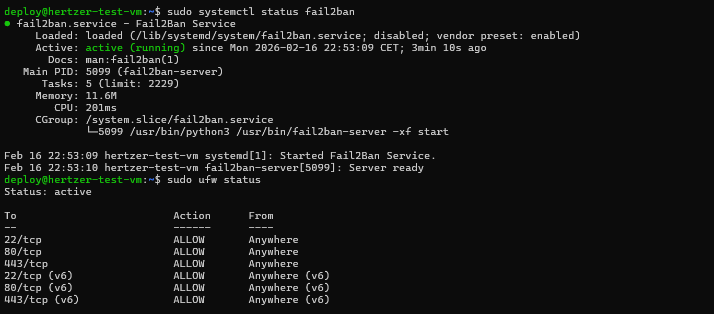

# Hetzner VM Bootstrapping

Automated deployment and hardening for Ubuntu 22.04 VMs using Multipass on Windows hosts. This setup includes specific patches for corporate network environments and cross-platform compatibility.

## Features
* **Automated Provisioning**: Fresh Multipass instance creation.
* **Network Fixes**: System DNS override to `8.8.8.8` and IPv6 disablement for stable connectivity.
* **Security Hardening**: 
    * Dedicated `deploy` user creation.
    * SSH hardening (Root login and password auth disabled).
    * **UFW** configuration (Ports 22, 80, 443).
    * **Fail2Ban** installation for brute-force protection.

## Core Modules

### 01 - System Configuration
Standardizes the base environment:
* **Package Management**: Non-interactive system updates and upgrades.
* **Tooling**: Installs `curl`, `git`, `htop`, and `unzip`.
* **Localization**: Sets the system hostname and timezone (`Europe/Berlin`).

### 02 - Security Hardening
Secures the instance for production-like environments:
* **User Management**: Creates a `deploy` user with passwordless sudo access.
* **SSH Hardening**: Disables root login and password-based authentication.
* **Firewall (UFW)**: Strictly allows only ports 22, 80, and 443.
* **Intrusion Prevention**: Configures **Fail2Ban** to monitor and block SSH brute-force attempts.
## Prerequisites
* Windows 10/11 with PowerShell 5.1+.
* Multipass for Windows.
* SSH Key: `id_ed25519` or `id_rsa` in `~/.ssh/`.

## Structure
* `test-local.ps1`: PowerShell runner for Windows.
* `setup.sh`: Main entry point for Linux configuration.
* `scripts/`: Modular shell scripts (System, Security, etc.).
* `config.env`: Auto-generated environment variables.

## Usage
1. Clone the repository to a local Windows directory.
2. Open PowerShell as Administrator.
3. Execute the runner:
   ```powershell
   .\test-local.ps1
    ```
## Verification
* **Network Configuration**: 
The script bypasses missing Hyper-V default switches by targeting active adapters and applying DNS overrides.

* **Security Status**: 
Service verification ensures the firewall is active and Fail2Ban is monitoring SSH traffic.

* **Access**: 
Connect to the instance using the deploy user:
   ```
    ssh deploy@<VM_IP> -i ~/.ssh/id_ed25519
    ```

